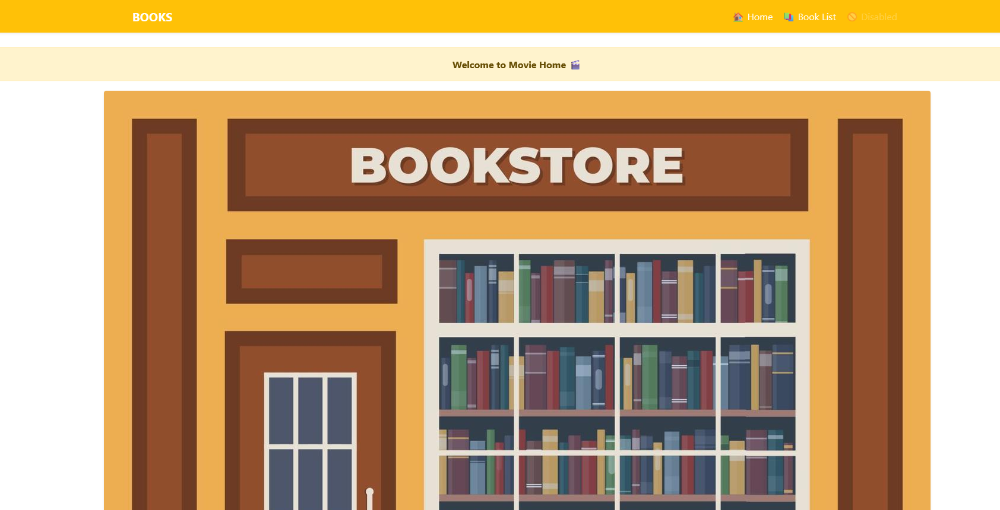
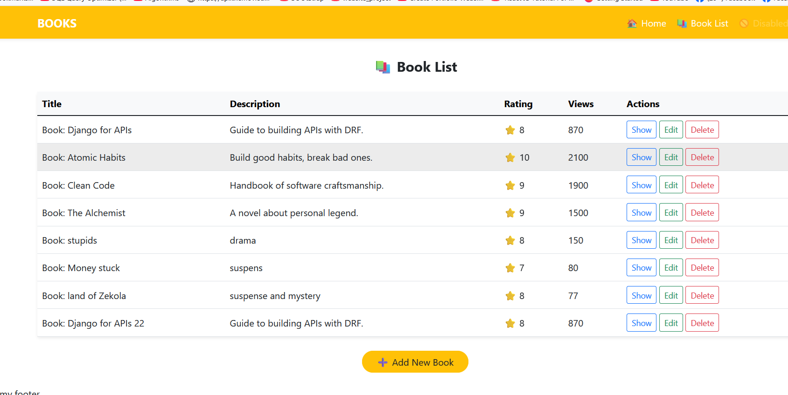
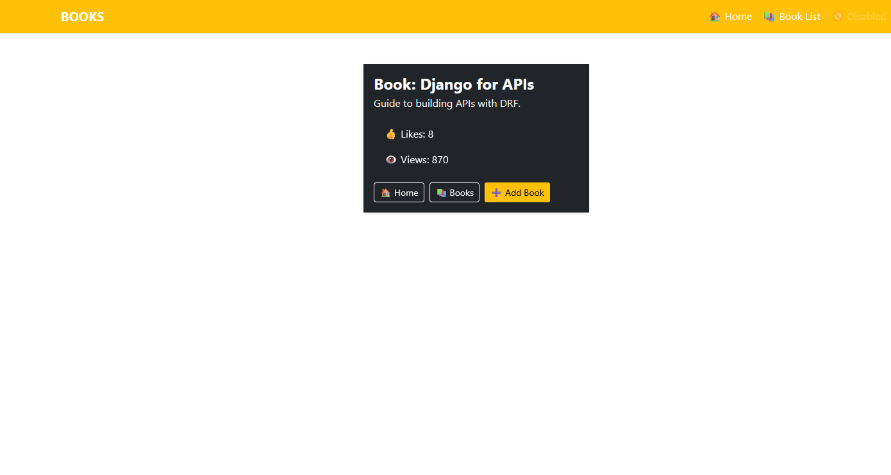

# 🛍️ Django Bookstore App

A simple and responsive web application for managing a list of books. Users can view, add, edit, and delete books with details like title, description, rating, and view count. Built using Django, this project is ideal for learning and demonstrating CRUD functionality in Django.

---

## 🚀 Features

- 📚 Display list of books  
- ➕ Add a new book  
- ✏️ Update book info  
- ❌ Delete a book  
- 📄 Detailed view of each book  
- 📦 Organized with Django apps (`book`, `home`)

---

## 🛠️ Tech Stack

- **Backend:** Python, Django  
- **Frontend:** HTML5, Bootstrap  
- **Database:** SQLite (default Django DB)

---

## ⚙️ Installation

1. **Clone the repository:**
   ```bash
   git clone https://github.com/EbrahimDewedar/Django-Bookstore-App.git
   cd Django-Bookstore-App

## 📸 Screenshots

### 🏠 Homepage


### 📚 Book List


### 📖 Book Details

